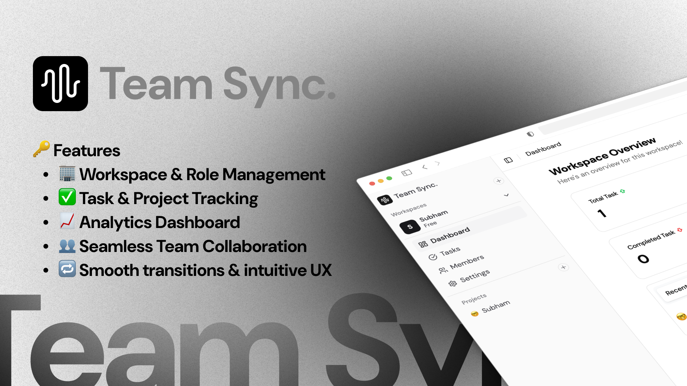

# TeamSync Frontend 🎨



[](https://vitejs.dev/)
[](https://reactjs.org/)
[](https://www.typescriptlang.org/)
[](https://tailwindcss.com/)
[](https://vercel.com/)
[](https://opensource.org/licenses/MIT)

> **Modern, responsive frontend for TeamSync - a powerful team collaboration and project management platform.**

Built with Vite, React 18, TypeScript, and Tailwind CSS, this frontend provides an intuitive interface for managing workspaces, projects, and tasks with real-time collaboration features.

## 🌟 Live Demo

- **Frontend**: [https://teamsync-frontend-subham.vercel.app](https://teamsync-frontend-subham.vercel.app)
- **API Documentation**: [Wiki](https://github.com/TeamSync-in/teamsync-backend-api/wiki)

## ✨ Frontend Features

### 🎨 **Modern UI/UX**

- 🌙 **Dark/Light theme** toggle with system preference detection
- 📱 **Fully responsive** design for all device sizes
- 🎭 **Smooth animations** and micro-interactions
- 🎯 **Intuitive navigation** with breadcrumbs and shortcuts
- 🔍 **Advanced search** and filtering capabilities

### ⚡ **Performance Optimized**

- 🚀 **Fast development** with Vite's hot module replacement
- 🔄 **Optimistic updates** for instant user feedback
- 💾 **Efficient state management** with Zustand
- 🌐 **Image optimization** and lazy loading
- 📦 **Tree shaking** for smaller bundle sizes

### 🔐 **Authentication & Security**

- 🔑 **Google OAuth 2.0** integration
- 🛡️ **JWT token management** with automatic refresh
- 🔒 **Protected routes** and role-based access
- 🚫 **Input validation** with Zod schemas

### 📋 **Workspace Management UI**

- 🏗️ **Workspace dashboard** with analytics
- 👥 **Member management** interface
- 📧 **Invite system** with shareable codes
- 📊 **Activity tracking** and notifications

### 🎯 **Project & Task Interface**

- 📝 **Kanban board** for task visualization
- ✅ **Task forms** with rich metadata
- 🎨 **Priority indicators** and status badges
- 📅 **Calendar integration** for due dates
- 👤 **Assignment interface** with user avatars

## 🛠️ Tech Stack

### **Frontend Technologies**

- **Build Tool**: Vite 5.0+ with fast HMR
- **Framework**: React 18+ with Hooks
- **Language**: TypeScript 5.0+
- **Styling**: Tailwind CSS + Shadcn/ui components
- **State Management**: Zustand + React Query (TanStack Query)
- **Forms**: React Hook Form + Zod validation
- **Icons**: Lucide React
- **Authentication**: JWT + Google OAuth 2.0
- **Deployment**: Vercel

### **Key Libraries**

- **@tanstack/react-query** - Server state management
- **zustand** - Client state management
- **react-hook-form** - Form handling
- **zod** - Schema validation
- **tailwindcss** - Utility-first CSS
- **shadcn/ui** - Reusable components
- **lucide-react** - Icon library
- **next-themes** - Theme management

## 🚀 Quick Start

### Prerequisites

- [Node.js](https://nodejs.org/) (v18 or higher)
- [npm](https://www.npmjs.com/) or [yarn](https://yarnpkg.com/)
- TeamSync Backend API running (see [backend repository](https://github.com/TeamSync-in/teamsync-backend-api))

### 1. Clone the Repository

```bash
git clone https://github.com/TeamSync-in/teamsync-frontend.git
cd teamsync-frontend
```

### 2. Install Dependencies

```bash
npm install
```

### 3. Environment Setup

Copy the environment file and configure your settings:

```bash
cp .env.example .env.local
```

Edit `.env.local` with your configuration:

```env
# Backend API URL
VITE_API_BASE_URL=http://localhost:8000

# Environment
NODE_ENV=development
```

### 4. Start Development Server

```bash
npm run dev
```

The application will be available at `http://localhost:3000`

### 5. Build for Production

```bash
npm run build
npm run preview  # Preview production build locally
```

## � Project Structure

```
frontend/
├── src/
│   ├── page/                # Application pages
│   │   ├── globals.css      # Global styles
│   │   ├── layout.tsx       # Root layout
│   │   ├── page.tsx         # Home page
│   │   ├── auth/            # Authentication pages
│   │   ├── dashboard/       # Dashboard pages
│   │   └── workspace/       # Workspace pages
│   ├── components/          # React components
│   │   ├── ui/              # Shadcn/ui components
│   │   ├── auth/            # Authentication components
│   │   ├── workspace/       # Workspace components
│   │   ├── project/         # Project components
│   │   ├── task/            # Task components
│   │   └── common/          # Shared components
│   ├── lib/                 # Utility libraries
│   │   ├── utils.ts         # Utility functions
│   │   ├── api.ts           # API client
│   │   └── auth.ts          # Authentication helpers
│   ├── hooks/               # Custom React hooks
│   │   ├── use-auth.ts      # Authentication hook
│   │   ├── use-workspace.ts # Workspace operations
│   │   └── use-tasks.ts     # Task management
│   ├── store/               # Zustand stores
│   │   ├── auth-store.ts    # Authentication state
│   │   ├── workspace-store.ts # Workspace state
│   │   └── theme-store.ts   # Theme management
│   ├── types/               # TypeScript types
│   │   ├── auth.ts          # Authentication types
│   │   ├── workspace.ts     # Workspace types
│   │   └── api.ts           # API response types
│   └── constants/           # Application constants
├── public/                  # Static files
│   ├── images/              # Image assets
│   └── icons/               # Icon files
├── .env.example            # Environment variables template
├── vite.config.ts          # Vite configuration
├── tailwind.config.js      # Tailwind CSS configuration
├── components.json         # Shadcn/ui configuration
└── package.json            # Dependencies and scripts
```

## 🔧 Environment Variables

Create a `.env.local` file in the root directory:

```env
# Backend API Configuration
VITE_API_BASE_URL=http://localhost:8000

# Development Configuration
NODE_ENV=development
```

### Production Environment

```env
# Backend API Configuration
VITE_API_BASE_URL=https://your-backend.vercel.app

# Production Configuration
NODE_ENV=production
```

## 📚 API Documentation

### Authentication Flow

1. User clicks "Login with Google"
2. Redirects to Google OAuth
3. Google redirects back with authorization code
4. Backend exchanges code for user info
5. JWT token issued and stored
6. User authenticated for subsequent requests

### Core Endpoints

#### **Authentication**

- `POST /api/auth/google` - Initiate Google OAuth
- `GET /api/auth/google/callback` - Handle OAuth callback
- `POST /api/auth/logout` - Logout user

#### **Workspaces**

- `GET /api/workspaces` - List user workspaces
- `POST /api/workspaces` - Create workspace
- `PUT /api/workspaces/:id` - Update workspace
- `DELETE /api/workspaces/:id` - Delete workspace
- `POST /api/workspaces/join` - Join with invite code

#### **Projects**

- `GET /api/projects` - List workspace projects
- `POST /api/projects` - Create project
- `PUT /api/projects/:id` - Update project
- `DELETE /api/projects/:id` - Delete project

#### **Tasks**

- `GET /api/tasks` - List project tasks
- `POST /api/tasks` - Create task
- `PUT /api/tasks/:id` - Update task
- `DELETE /api/tasks/:id` - Delete task

For complete API documentation, visit our [Wiki](https://github.com/TeamSync-in/teamsync-backend-api/wiki).

## 🚀 Deployment

### Vercel (Recommended)

#### Automatic Deployment

1. Connect your GitHub repository to Vercel
2. Configure environment variables in Vercel dashboard
3. Deploy automatically on every push to main branch

#### Manual Deployment

```bash
# Install Vercel CLI
npm install -g vercel

# Deploy to Vercel
vercel --prod
```

### Manual Deployment

#### Build and Deploy

```bash
# Build the application
npm run build

# Preview production build locally
npm run preview
```

### Environment Variables for Production

Set these in your Vercel dashboard or deployment platform:

```env
VITE_API_BASE_URL=https://your-backend-api.vercel.app
NODE_ENV=production
```

## 🧪 Testing

### Run Tests

```bash
# Run all tests
npm test

# Run tests in watch mode
npm run test:watch

# Run tests with coverage
npm run test:coverage
```

### Testing Structure

- **Unit Tests**: Component testing with Jest and React Testing Library
- **Integration Tests**: API integration testing
- **E2E Tests**: End-to-end testing with Playwright

## 📱 Responsive Design

TeamSync frontend is optimized for all device sizes:

### Breakpoints

- **Mobile**: 375px - 767px
- **Tablet**: 768px - 1023px
- **Desktop**: 1024px - 1439px
- **Large Desktop**: 1440px+

### Features by Device

- **Mobile**: Touch-optimized interface, collapsible navigation
- **Tablet**: Adaptive layouts, touch and mouse support
- **Desktop**: Full feature set, keyboard shortcuts
- **Large Desktop**: Multi-column layouts, extensive data views

## 🤝 Contributing

We welcome contributions to the TeamSync frontend! Here's how you can help:

### Getting Started

1. **Fork** the repository
2. **Clone** your fork locally
3. **Create** a feature branch
4. **Install** dependencies: `npm install`
5. **Start** development server: `npm run dev`
6. **Make** your changes
7. **Test** your changes
8. **Submit** a pull request

### Development Guidelines

- 📝 **Follow** existing code style and conventions
- 🎨 **Use** Tailwind CSS for styling
- 🧩 **Create** reusable components in `/components`
- 🔍 **Write** TypeScript types for all data structures
- ✅ **Add** tests for new components and features
- 📚 **Update** documentation as needed

### Code Style

- **ESLint** configuration for code quality
- **Prettier** for code formatting
- **TypeScript** for type safety
- **Conventional Commits** for commit messages

### Component Guidelines

- Use **Shadcn/ui** components as base
- Follow **atomic design** principles
- Implement **responsive design** for all components
- Add **proper accessibility** attributes
- Include **loading states** and error handling

## 🎨 UI Components

### Design System

- **Colors**: Tailwind CSS color palette with custom theme
- **Typography**: Inter font family with consistent sizing
- **Spacing**: 8px grid system
- **Shadows**: Subtle elevation system
- **Animations**: Smooth transitions and micro-interactions

### Key Components

- **Dashboard Layout**: Responsive sidebar navigation
- **Data Tables**: Sortable, filterable, paginated tables
- **Forms**: Validated forms with error handling
- **Modals**: Accessible dialog components
- **Cards**: Consistent content containers
- **Buttons**: Various styles and states
- **Input Fields**: Form controls with validation
- **Navigation**: Breadcrumbs, tabs, and menus

## 📊 Performance

### Optimization Features

- **Build Optimization**: Vite's optimized production builds
- **Code Splitting**: Automatic route-based code splitting
- **Bundle Analysis**: Webpack bundle analyzer integration
- **Lazy Loading**: Components and images loaded on demand
- **Caching**: Efficient caching strategies
- **Prefetching**: Intelligent route prefetching

### Performance Metrics

- **Lighthouse Score**: 95+ across all categories
- **First Contentful Paint**: < 1.5s
- **Largest Contentful Paint**: < 2.5s
- **Cumulative Layout Shift**: < 0.1
- **Time to Interactive**: < 3.0s

## 🌙 Theme Support

### Theme Features

- **System Theme**: Automatically detects system preference
- **Manual Toggle**: User can override system settings
- **Persistent Storage**: Theme preference saved locally
- **Smooth Transitions**: Animated theme switching

### Available Themes

- **Light Mode**: Clean, bright interface
- **Dark Mode**: Easy on the eyes for extended use
- **System**: Follows device settings

## 📊 Roadmap

### 🚧 Current Phase (v1.0)

- [x] User authentication with Google OAuth
- [x] Multi-workspace support
- [x] Project and task management
- [x] Role-based permissions
- [x] Responsive UI design
- [x] Real-time updates

### 🔮 Upcoming Features (v1.1)

- [ ] **Real-time collaboration** with WebSockets
- [ ] **File attachments** for tasks
- [ ] **Time tracking** and reporting
- [ ] **Advanced notifications** system
- [ ] **Mobile app** development
- [ ] **API rate limiting** and usage analytics

### 🌟 Future Vision (v2.0+)

- [ ] **Video conferencing** integration
- [ ] **Advanced project templates**
- [ ] **Custom workflows** and automation
- [ ] **Third-party integrations** (Slack, Discord, etc.)
- [ ] **Advanced analytics** and insights
- [ ] **Multi-language support**

## 🏆 Performance

### Lighthouse Scores

- **Performance**: 95+
- **Accessibility**: 100
- **Best Practices**: 100
- **SEO**: 100

### Technical Metrics

- **First Contentful Paint**: < 1.5s
- **Largest Contentful Paint**: < 2.5s
- **Cumulative Layout Shift**: < 0.1
- **Time to Interactive**: < 3.0s

## 🔒 Security

### Security Measures

- 🔐 **JWT authentication** with secure token handling
- 🛡️ **CORS protection** for cross-origin requests
- 🚫 **Rate limiting** to prevent abuse
- 🔒 **Input validation** and sanitization
- 🌐 **HTTPS enforcement** in production
- 🔑 **Environment variable** protection

### Security Audits

- Regular dependency updates
- Automated vulnerability scanning
- Security headers implementation
- SQL injection prevention
- XSS protection

## 📈 Analytics & Monitoring

### Performance Monitoring

- Real-time error tracking
- Performance metrics
- User behavior analytics
- API response times
- Database query optimization

### Business Metrics

- User registration rates
- Workspace creation trends
- Task completion rates
- User engagement metrics
- Feature adoption rates

## 🌍 Browser Support

- ✅ **Chrome** 90+
- ✅ **Firefox** 88+
- ✅ **Safari** 14+
- ✅ **Edge** 90+
- 📱 **Mobile browsers** (iOS Safari, Chrome Mobile)

## 📱 Mobile Support

TeamSync is fully responsive and optimized for:

- 📱 **Mobile phones** (375px and up)
- 📱 **Tablets** (768px and up)
- 💻 **Desktops** (1024px and up)
- 🖥️ **Large screens** (1440px and up)

## 🌐 Internationalization

Currently supported languages:

- 🇺🇸 **English** (Default)

Planned languages:

- 🇪🇸 Spanish
- 🇫🇷 French
- 🇩🇪 German
- 🇯🇵 Japanese

## 🎯 Use Cases

### **For Startups**

- Manage product development
- Track feature requests
- Coordinate team efforts
- Monitor project progress

### **For Agencies**

- Organize client projects
- Manage multiple teams
- Track billable hours
- Collaborate with clients

### **For Enterprises**

- Cross-department collaboration
- Project portfolio management
- Resource allocation
- Compliance tracking

### **For Freelancers**

- Personal project management
- Client communication
- Time tracking
- Progress reporting

## 📞 Support & Links

### Get Help

- 📧 **Email**: extraordinary0123456789@gmail.com
- 🐛 **Bug Reports**: [GitHub Issues](https://github.com/TeamSync-in/teamsync-frontend/issues)
- 💬 **Discussions**: [GitHub Discussions](https://github.com/TeamSync-in/teamsync-frontend/discussions)
- 📚 **Documentation**: [Project Wiki](https://github.com/TeamSync-in/teamsync/wiki)

### Related Repositories

- 🔗 **Backend API**: [teamsync-backend-api](https://github.com/TeamSync-in/teamsync-backend-api)
- 📦 **Organization**: [teamsync](https://github.com/TeamSync-in)
- 📖 **Documentation**: [API Docs](https://github.com/TeamSync-in/teamsync-backend-api/wiki)

### Community

- 🌟 **Star** this repository if you find it helpful
- 🍴 **Fork** and contribute to the project
- � **Share** with your network
- � **Suggest** new features and improvements

## 📄 License

This project is licensed under the **MIT License** - see the [LICENSE](LICENSE) file for details.

## 👨‍💻 Author

**Subham Paul**

- 🌐 **Portfolio**: [Subham Paul](https://subham-paul-new-portfolio.vercel.app)
- 💼 **LinkedIn**: [Subham Paul](https://linkedin.com/in/iam-subham-paul)
- 🐙 **GitHub**: [@ItisSubham](https://github.com/ItisSubham)
- 📧 **Email**: extraordinary0123456789@gmail.com

## 🙏 Acknowledgments

### Frontend Technologies

- [Vite](https://vitejs.dev/) - Fast build tool for modern web projects
- [React](https://reactjs.org/) - JavaScript library for building user interfaces
- [TypeScript](https://www.typescriptlang.org/) - Typed JavaScript at any scale
- [Tailwind CSS](https://tailwindcss.com/) - Utility-first CSS framework
- [Shadcn/ui](https://ui.shadcn.com/) - Beautifully designed components
- [Zustand](https://zustand-demo.pmnd.rs/) - Small, fast and scalable state management
- [React Query](https://tanstack.com/query) - Powerful data synchronization for React

### Design Inspiration

- [Linear](https://linear.app/) - Clean, modern interface design
- [Notion](https://notion.so/) - Workspace organization concepts
- [Vercel](https://vercel.com/) - Deployment platform and design inspiration
- [Radix UI](https://www.radix-ui.com/) - Low-level UI primitives

---

<div align="center">

**Built with ❤️ by [Subham Paul](https://github.com/ItisSubham)**

⭐ **Star this repository if you find it helpful!** ⭐

[🚀 Live Demo](https://teamsync-frontend-subham.vercel.app) | [📚 API Docs](https://github.com/TeamSync-in/teamsync-backend-api/wiki) | [🐛 Report Bug](https://github.com/TeamSync-in/teamsync-frontend/issues) | [✨ Request Feature](https://github.com/TeamSync-in/teamsync-frontend/issues)

</div>
